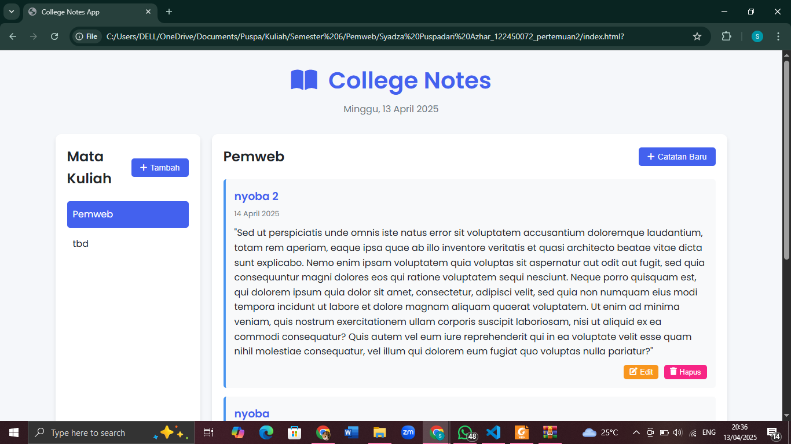
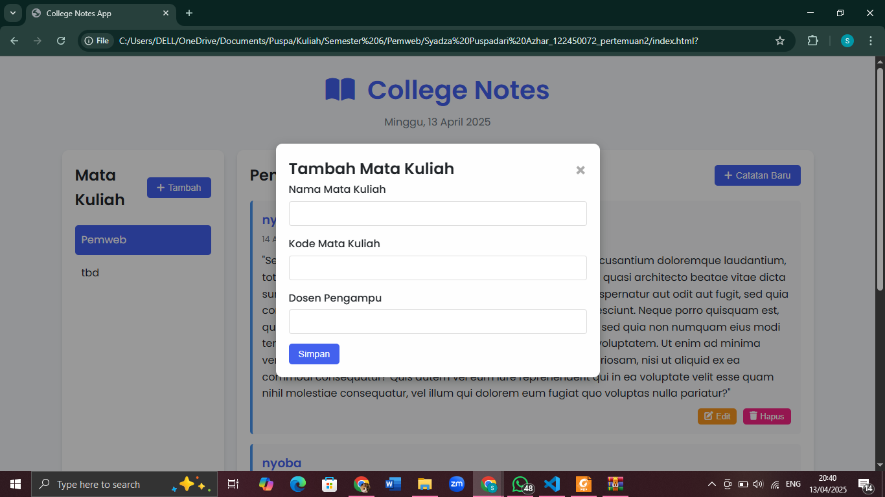
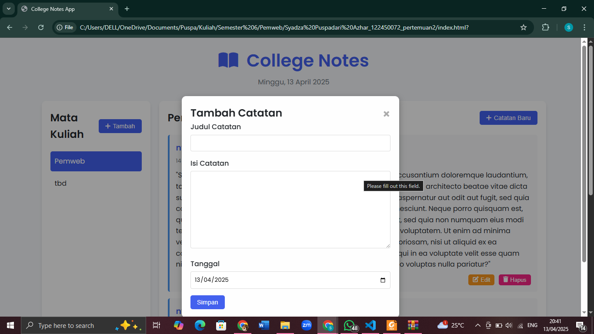
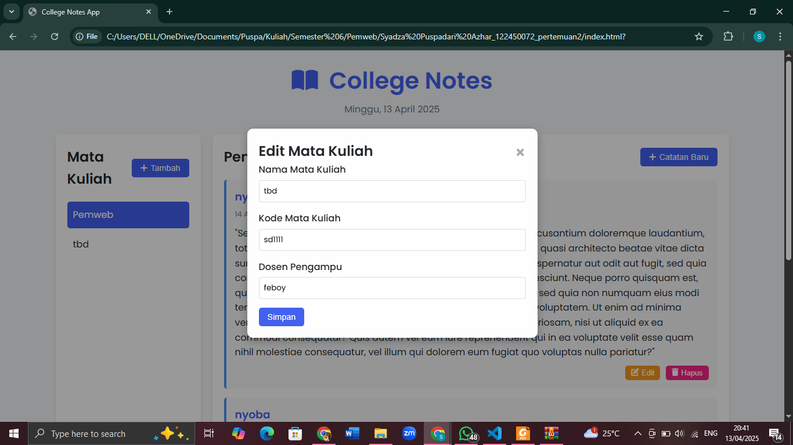
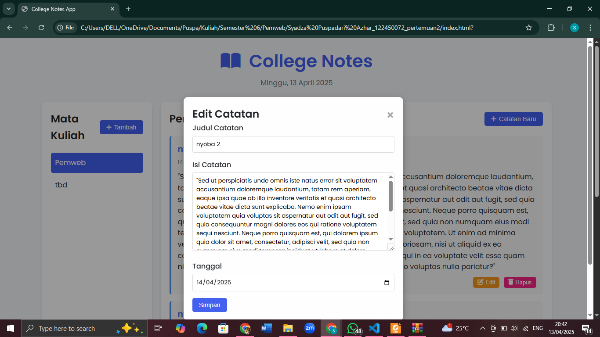
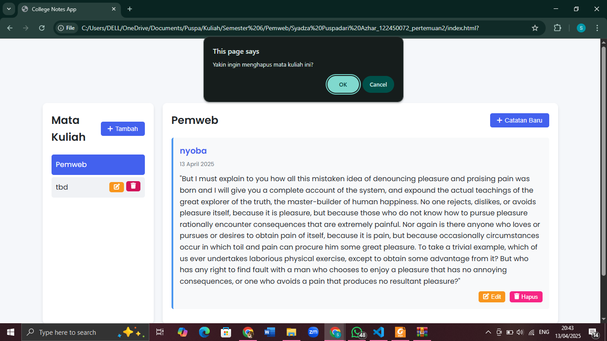

# 🎓 College Notes App

Aplikasi **College Notes App** adalah personal dashboard untuk mahasiswa yang membantu mencatat, mengelola, dan mengorganisir informasi penting dari setiap mata kuliah. Aplikasi ini dirancang sederhana namun fungsional, dan berjalan sepenuhnya di sisi klien menggunakan HTML, CSS, dan JavaScript modern.

---

## ✨ Fitur Aplikasi

- 📘 **Manajemen Mata Kuliah**
  - Tambah, edit, dan hapus daftar mata kuliah.
  
- 📝 **Catatan Mata Kuliah**
  - Tambah, edit, dan hapus catatan per mata kuliah.
  - Catatan disimpan secara lokal dengan `localStorage`.

---

## ✅ Fitur ES6+ yang Diimplementasikan

| Fitur ES6+        | Deskripsi                                                                   |
|-------------------|-----------------------------------------------------------------------------|
| `let` dan `const` | Digunakan untuk deklarasi variabel yang berubah dan tidak berubah           |
| Arrow Functions   | Digunakan dalam fungsi seperti `generateId`, `renderNotes`, dll.            |
| Template Literals | Untuk membuat HTML dinamis dengan `${}` di dalam string backtick `` ` ``    |
| Classes           | Aplikasi dibangun menggunakan class `Course`, `Note`, dan `CollegeNotesApp` |
| Default Parameters| Seperti pada `Note(date = new Date(), important = false)`                   |
| localStorage      | Menyimpan semua data aplikasi di browser tanpa backend                      |

---

## 📁 Struktur File

```
├── index.html       # Struktur dan elemen UI
├── style.css        # Desain dan styling (termasuk mode gelap)
├── app.js           # Logika aplikasi dan manajemen data
└── README.md        # Penjelasan aplikasi, screenshot aplikasi dan fitur ES6+
```

---

## 🛠 Teknologi
- HTML5
- CSS3
- JavaScript (ES6+)

---

## Screenshot Aplikasi







##Link Aplikasi
https://pemrograman-web-itera-122450072-9jm9.vercel.app/

## 👩‍💻 Dibuat Oleh
**Syadza Puspadari Azhar - 122450072**
