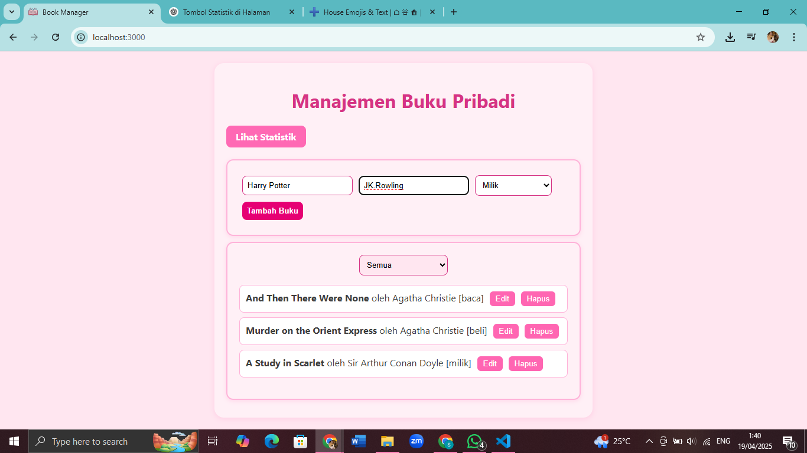

# 📚 Aplikasi Manajemen Buku Pribadi

Aplikasi **Manajemen Buku Pribadi** adalah aplikasi berbasis React yang memungkinkan pengguna untuk mencatat, mengelola, dan memantau koleksi buku pribadi mereka. Pengguna dapat menambahkan, mengedit, menghapus, serta memfilter buku berdasarkan status seperti "milik", "sedang dibaca", atau "ingin dibeli". Aplikasi ini juga menyimpan data secara lokal menggunakan `localStorage`.

---

## 🚀 Instalasi dan Menjalankan Aplikasi

Berikut langkah-langkah untuk menjalankan aplikasi ini secara lokal:

1. **Clone repositori**
   ```bash
   git clone https://github.com/username/book-manager.git
   cd book-manager
   ```

2. **Instal dependensi**
   ```bash
   npm install
   ```

3. **Jalankan aplikasi**
   ```bash
   npm start
   ```

4. Aplikasi akan tersedia di `http://localhost:3000`

---

## ⚙️ Fitur React yang Digunakan

Adapun fitur React yang digunakan dalam aplikasi ini yaitu:

### ✅ **Functional Components**
Seluruh komponen ditulis dalam bentuk *function component*, memanfaatkan `useState`, `useEffect`, dan hook lainnya.

### ✅ **Context API**
Digunakan untuk membuat *state global* (`BookContext`) agar data buku bisa diakses oleh komponen mana pun tanpa perlu *prop drilling*.

```jsx
<BookProvider>
  <App />
</BookProvider>
```

### ✅ **Custom Hooks**
Terdapat dua *custom hook*:
- `useLocalStorage` untuk menyimpan data buku di `localStorage`.
- `useBookStats` untuk menghitung statistik buku seperti jumlah total, yang dimiliki, dibaca, dan ingin dibeli.

### ✅ **React Router**
Routing menggunakan `react-router-dom` versi 6, dengan dua halaman utama:
- `/` → halaman manajemen buku
- `/stats` → halaman statistik buku

### ✅ **CSS Modular**
Setiap komponen memiliki file CSS tersendiri yang menjaga modularitas dan keterbacaan kode.

---

## 📌 Struktur Folder

```
public
├── index.html
src/
├── components/
│   ├── BookForm/
│   │   ├── BookForm.js
│   │   └── BookForm.css
│   ├── BookList/
│   │   ├── BookList.js
│   │   └── BookList.css
│   └── BookFilter/
│       ├── BookFilter.js
│       └── BookFilter.css
├── context/
│   └── BookContext.js
├── hooks/
│   ├── useLocalStorage.js
│   └── useBookStats.js
├── pages/
│   ├── Home/
│   │   ├── index.js
│   │   └── Home.css
│   └── Stats/
│       ├── index.js
│       └── Stats.css
├── App.css
├── App.js
└── index.js
```

---

## 📸 Tampilan Aplikasi



---

## 🔗 Link Aplikasi

https://pemrograman-web-itera-122450072.vercel.app/

---
